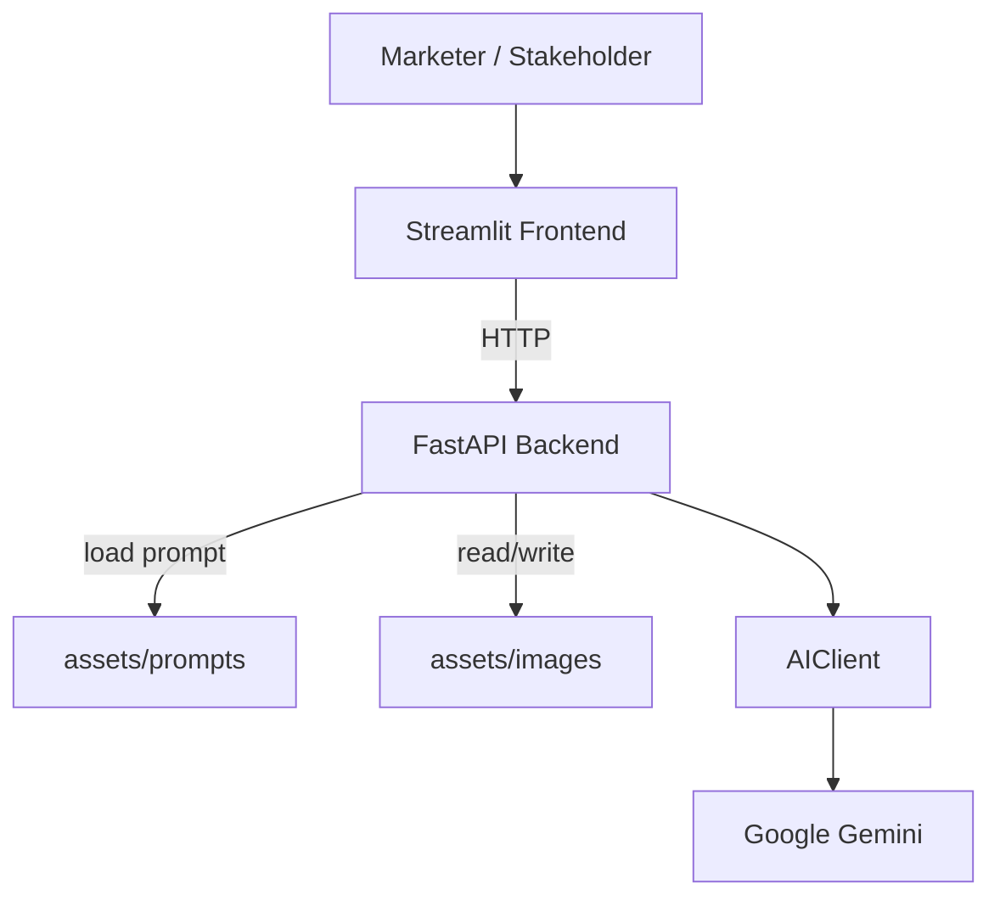
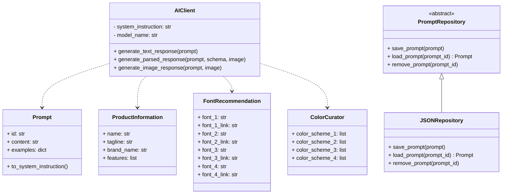
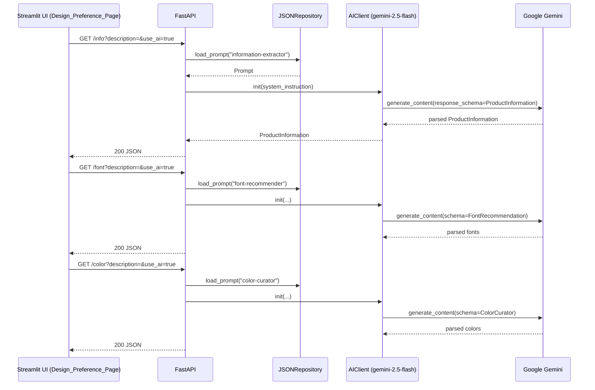
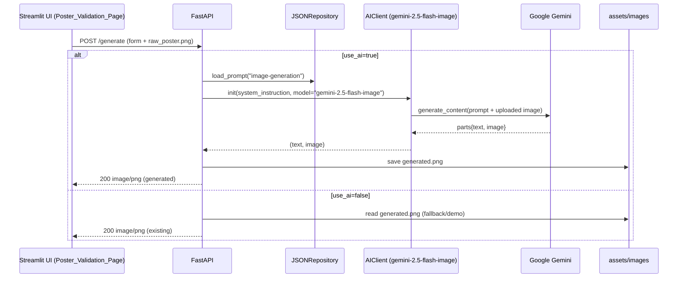

# Word of Marketing – AI Marketing Poster Generator (Tesco Hackathon) 🚀🖼️

An AI‑assisted tool that helps non‑designers produce on‑brand retail marketing posters in minutes. It combines a modern
Streamlit frontend with a FastAPI backend and Google Gemini models to extract product information, recommend fonts and
color palettes, and generate a final poster image.

Built for a Tesco hackathon to streamline creative production for promos, launches, and in‑store digital posters.

---

## 👥 Made by

- Harshita Gaurav — **harshitagaurav26@gmail.com**
- Kshitij Srivastava — **kshitijsrivastava2312@gmail.com**

---

## ✨ Highlights

- ✅ End‑to‑end poster flow: assets → design preferences → layout → validation → final image
- 🧠 AI‑powered steps using Google Gemini:
    - 🧾 Product info extraction from description (`/info`)
    - 🔤 Font recommendations (`/font`)
    - 🎨 Color palette curation (`/color`)
    - 🖼️ Poster image synthesis/refinement (`/generate`)
- 🧩 Prompt‑driven behavior stored in versioned JSON under `assets/prompts`
- 🧼 Clean separation of concerns with a small AI client wrapper and typed Pydantic models

---

## 🗂️ Project Structure

```
Marketing-Tool/
├─ assets/
│  ├─ images/
│  │  └─ generated.png                  # latest generated poster (for demo/preview)
│  └─ prompts/
│     ├─ secrets.json                   # A list of prompts and examples for the LLM (they're secret! shh...)
├─ client/
│  ├─ ai.py                             # Google Gemini wrapper (text/json/image)
│  ├─ models.py                         # Pydantic response models
│  └─ prompts.py                        # Prompt repository abstractions + JSON impl
├─ frontend/
│  ├─ Home.py                           # Streamlit entry
│  └─ pages/
│     ├─ Assets_Page.py                 # Upload description + images
│     ├─ Design_Preference_Page.py      # Calls /info, /font, /color
│     ├─ Layout_Preference_Page.py      # Visual layout choices
│     └─ Poster_Validation_Page.py      # Calls /generate, shows result
├─ main.py                              # FastAPI app exposing endpoints
├─ requirements.txt
└─ README.md
```

---

## 🧱 Architecture Overview

### 🧩 Component Diagram



### 📦 Data Models (Pydantic)

- `ProductInformation`: `name`, `tagline`, `brand_name`, `features: list[str]`
- `FontRecommendation`: `font_1..4` + matching `font_1..4_link` (Google Fonts `<link>` tags)
- `ColorCurator`: `color_scheme_1..4` as `[primary_hex, secondary_hex]`

### 🧰 Core Classes



### Key Flows (Sequence)

Product details and preferences are gathered in the frontend and resolved by the backend using prompts and models.





---

## 🛠️ Running Locally

### 1) ✅ Prerequisites

- Python 3.12+
- A Google Generative AI API key with access to Gemini 2.5 models

### 2) 📦 Install dependencies

```
pip install -r requirements.txt
# The backend is served via Uvicorn (install if missing):
pip install "uvicorn[standard]"
```

### 3) 🔐 Add your API key

Create a `.env` file in the project root:

```
GOOGLE_API_KEY=your_api_key_here
```

### 4) ⚡ Start the backend (FastAPI)

```
uvicorn main:app --reload --port 8000
```

### 5) 🎛 Start the frontend (Streamlit)

```
streamlit run frontend/Home.py
```

> [!TIP]
> The frontend calls the backend at `http://127.0.0.1:8000` by default.

---

## Frontend Flow (Streamlit)

1. Assets Manager
    - Paste a product description, upload hero/logo/support images (background removed via `rembg`).
2. Design Preferences
    - Hits `/info`, `/font`, `/color` (optional AI via toggle) and presents options for font, colors, hero feature,
      size.
3. Layout Preferences
    - Choose placement/positions for hero, logo, and support assets on a grid of thumbnails.
4. Poster Validation
    - Provide comments; click “Generate Poster” → uploads current poster preview to `/generate` and shows the result.

---

## 🧪 API Reference

Base URL: `http://127.0.0.1:8000`

- GET `/info`
    - Query: `description: str`, `use_ai: bool = false`
    - Returns: `ProductInformation`

- GET `/font`
    - Query: `description: str`, `use_ai: bool = false`
    - Returns: `FontRecommendation`

- GET `/color`
    - Query: `description: str`, `use_ai: bool = false`
    - Returns: `ColorCurator`

- POST `/generate`
    - Form fields:
      `name, tagline, brand_name, font, primary_color, secondary_color, hero_feature, size, comments?, use_ai?`
    - Files: `raw_poster` (PNG/JPG)
    - Returns: `image/png`

> [!IMPORTANT]
> With `use_ai=false`, endpoints return curated defaults to keep the flow usable during testing without making expensive
> AI calls.

---

## Configuration & Prompts

Prompts live in `assets/prompts/*.json` and are loaded by ID via the `JSONRepository`. They include:

- `information-extractor.json` – extracts `ProductInformation` from a free‑form description.
- `font-recommender.json` – proposes four display fonts + Google Fonts `<link>` tags.
- `color-curator.json` – generates four primary/secondary color pairs (HEX) with contrast/harmony constraints.
- `image-generation.json` – controls overall look, scene, brand feel, and composition for the final poster.

Prompts include examples to steer model behavior and to improve determinism for structured outputs.

---

## ️ 🖼️ Screenshots

Below is the latest generated poster artifact saved by the backend (for demo):


---

## Roadmap

- Add auth and project workspaces
- Export packs: PNG, PDF, social aspect ratios
- Rich text editing over generated poster (titles, badges, price bubbles)
- Persistent storage for assets and variants
- Batch generation for SKUs and A/B testing
- Optional CORS and cloud deployment templates

---

## Contributing

PRs welcome for UI polish and new layouts. For larger changes, please open an issue to discuss the
approach first.

---

## License

For hackathon/demo use. Please check with the authors before reusing in production contexts.
